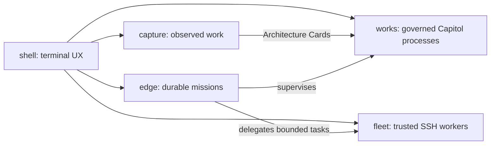

# Conch

**An AI shell that learns your work and automates it — with your approval at every step.**

Local-first. Everything it does is captured, reviewed, and auditable: from
one-off commands to durable missions running across your machines.

**Capture → compile → operate.**

[Official website](https://conch-site-gamma.vercel.app/) ·
[Current release: v0.7.0][release] ·
[Changelog](CHANGELOG.md) · [MIT License](LICENSE)

[release]: https://github.com/detournement/conch/releases/tag/v0.7.0

```bash
curl -fsSL https://conch-site-gamma.vercel.app/install | sh
```

The installer supports **macOS and Linux**, uses an isolated `uv`, `pipx`, or
private-venv install, and never needs `sudo`. Native Windows is not supported;
WSL2 follows the Linux path. The public installer currently installs the
maintained GitHub `edge` tarball—not a PyPI package—and re-running it upgrades
the installation.

## Quick tour

Slash commands below run inside a `conch` chat session.

### Ask mode

`conch-ask` returns one structured shell command and does not execute it:

```bash
conch-ask "compress this folder but skip node_modules"
# tar --exclude=node_modules -czf archive.tgz .
```

### Chat

```bash
conch
```

The shell resumes the most recent conversation. Use `conch --new` for a fresh
one, or send a single prompt without entering the interactive shell:

```bash
conch "explain the failing tests in this repository"
```

### Edit code with a sandbox and undo

Start `conch` from a Git repository, then:

```text
/sandbox docker
Refactor the authentication module and run its focused tests.
/checkpoint list
/undo
```

Docker changes where approved shell commands run; it does not bypass Conch's
permission checks. Conch automatically records each changed turn on
`refs/conch/checkpoints/*`, without adding commits to your branch. `/undo`
restores the latest snapshot as uncommitted work after confirmation.

### Start a durable mission

Setup marker: run `/install edge` once on the controller.

```text
/install edge
/mission new "watch disk usage on burt and alert me before it fills"
/missions
```

The supervised edge daemon owns the mission through terminal exits, crashes,
and reboots.

### Find recurring work to automate

Setup marker: capture is opt-in.

```text
/install capture
/compile suggestions
/compile from-suggestion 1
```

Suggestions are ranked deterministically from repeated work shapes. The result
is only a draft Architecture Card; it still needs local review and approval.

### Operate remotely, on the fleet, or through Capitol

Direct SSH is part of the shell:

```text
/ssh connect thom@192.0.2.152
/ssh exec df -h /
/ssh disconnect
```

Fleet setup marker: `/install fleet`.

```text
/install fleet
/fleet enroll burt-1 burt@192.0.2.152
/fleet run burt-1 "report uname -a and disk free"
```

Capitol setup marker: `/install works`.

```text
/install works
/capitol workflows
Backfill funding intake for the first week of September.
```

Always-on Matrix, Slack, SMS, and email operation uses `/install edge` plus
channel configuration and fail-closed sender allowlists.

## The five components

The shell is installed first. The other four components already ship in the
same distribution behind configuration gates; today, `/install` means
enable, configure, and install any supervised user service. Run `/install`
inside Conch to see their current status.



### shell — installed first

The terminal UX: ask mode, chat, tools, skills, memory, and scheduling. This is
what the website one-liner at the top installs.

### edge — `/install edge`

An always-on personal daemon: durable missions, timers, approvals, and phone
channels that keep running when the terminal closes. It installs as a
supervised launchd service on macOS or systemd user service on Linux.

### fleet — `/install fleet`

Trusted SSH machines as signed, bounded workers: a task plane with leases,
retries, grants, and content-addressed artifacts. Workers are replaceable
compute; authority and durable state remain on the controller.

### works — `/install works`

An optional `conch-works` distribution (currently installed from the private
`detournement/conch-works` repository using existing Git/gh SSH
authentication) for governed business processes over the
[Capitol](https://capitol.ai) A2A gateway: deterministic runs, compiled
processes, and supervised missions. `/capitol` operates existing workflows;
`/compile` designs reviewed processes. Set `CONCH_WORKS_PACKAGE_SPEC` or use
`/install works --package <spec>` to test a wheel or alternate private source.
The base shell remains healthy without Works and does not expose its commands
or tools.

### capture — `/install capture`

Opt-in and local-first: sessions, missions, shell history, a designated email
folder, Scribe guides, and allowlisted browser work become drafts that the
compiler can turn into governed automations. Capture never approves or
provisions anything itself. Local evidence collection can be enabled without
Works; Capture→Card compilation and Capitol materialization require
`/install works`.

## Capture to compile to operate

Capture turns work that already happened into evidence for the
ProcessCompiler. Nothing capture-related runs until `/install capture` sets
`capture_enabled=true`.

### 1. Choose a source

```text
/compile from-session [<conversation-id>] ["goal"]
/compile from-mission <mission-id> ["goal"]
/compile from-history [N] "goal"
/compile from-email [--rescan] ["goal"]
/compile from-scribe "<guide>" ["goal"]
/compile from-browser [origin] ["goal"]
/compile from-procedure <workflow-id> --version N ["goal"]
```

- **Mission and session:** bounded journal or conversation traces, including
  commands and tool results.
- **Shell history:** recent zsh or bash history with repeated lines collapsed.
  Credential-shaped lines are dropped with a disclosed count; an explicit
  goal is required because raw history is heterogeneous.
- **Email:** a designated `capture_email_folder`, read-only over the configured
  IMAP account and guarded by `email_allowed_senders`. A per-folder UID cursor
  advances only after the compilation is stored.
- **Scribe:** a guide from Scribe's hosted MCP endpoint. Set `scribe_mcp_url`
  and name the OAuth-token environment variable with `scribe_token_env`.
- **Browser:** semantic events from explicitly allowlisted origins, stored in
  the local mission kernel.
- **Capitol Procedure:** one exact Procedure Document plus its exact underlying
  workflow-version payload. Procedure prose is bounded inert evidence;
  executable identity and semantics come from the workflow payload, never from
  reconstructed prose. Without a new goal, the draft proposes exact adoption;
  with a goal, it proposes an adaptation.

Every draft records capture provenance: source identifiers, event or UID
ranges, and counts. Captured text is inert evidence, never an instruction with
authority.

### 2. Mine deterministic suggestions

```text
/compile suggestions
/compile suggestions --days 14 --min 4
/compile from-suggestion 1
```

Conch normalizes command and browser step sequences, mines recurring n-grams,
and ranks them count-first with stable tie-breaks. There is no model ranking in
this step. Each suggestion explains its evidence, and
`/compile from-suggestion` includes the original commands as samples.

Tune the defaults with `compile_suggest_min_count` and
`compile_suggest_window_days`.

### 3. Review the Architecture Card

Whether the input is a goal or captured work, compilation produces a versioned
Architecture Card:

```text
/compile "triage inbound vendor invoices weekly"
/compile list
/compile show <id>
/compile revise <id> "keep the existing intake workflow"
/compile approve <id>
```

The card describes success criteria, process stages, reused and proposed
assets, authority caps, approval classes, HITL points, eval criteria, a
synthetic drill, rollout, rollback, estimates, and open questions. Validation
is fail-closed and reuse-first. Approval is local-only in v1, pins the exact
card digest, and is invalidated by any revision. Procedure-seeded designs use
strict `conch.architecture_card.v2` immutable Procedure/workflow
version-and-digest references; existing v1 cards remain readable and
replayable.

### 4. Materialize and operate

```text
/install works
/compile materialize <id>
/compile status <id> --procedures
/compile rollback <id>
```

Materialization requires `capitol_admin=true`, the configured local Capitol
serving stack, and an approved card. It provisions in dependency order, runs
the generated acceptance drill, and creates the supervising mission only after
verification. Receipts and rollback references make retries idempotent and
allow `/compile rollback` to revert created assets without deleting adopted
ones. Capitol compiles the human-readable Procedure; Conch reconciles the exact
workflow version, appends a replayable `compilation_procedure_linked` event,
and writes a separate materialization lock covering the Card, pack, workflow,
Procedure, and schedules. A missing projection is
`documentation_pending`—the workflow remains materialized and may drill in
shadow. Workflow-version or Procedure-digest drift fails closed. Because
Capitol starts and schedules are not yet version-addressed, Procedure-linked
schedules remain disabled in shadow.

Authority stays separate:

- capture provenance records what was observed, never authorization;
- the approved Architecture Card digest is design/authorization truth;
- the exact workflow version and run events are execution truth;
- the Procedure is a readable projection and its review/accreditation attests
  documentation only.

The normal lifecycle is:

```text
compiled → approved → materialized → verified → operating
```

Capture has no shortcut around that lifecycle.

### Browser capture on macOS Chrome

Chrome on macOS is the proven path. Linux Chromium-family host paths ship but
remain experimental; Firefox is not supported.

1. In Conch, run:

   ```text
   /install capture browser
   ```

2. Open `chrome://extensions`, enable **Developer mode**, choose
   **Load unpacked**, and select:

   ```text
   ~/.local/share/conch/browser-capture/extension
   ```

   The pinned extension id is `hgmjnpkpdnaeekckabogikdcpdfeeghh`.

3. Open the extension's Options page and add each origin you want captured.
   Chrome asks for that per-origin permission. Nothing is captured before an
   origin is allowlisted.

4. Verify with `/install` or `conch-capture-host status`, then use:

   ```text
   /compile from-browser github.com "automate the release procedure"
   ```

Privacy boundaries are structural:

- no `<all_urls>` permission; both extension and host reject other origins;
- navigation stores the path, never query strings or fragments;
- clicks store role and accessible label, never coordinates;
- submits store form and field names, never values; password and
  secret-looking fields are excluded at the source and host;
- copy events store only that a copy happened, never clipboard contents;
- no keystrokes, page text, screenshots, input values, or clipboard text;
- native messaging uses stdio—no listening port and no cloud service;
- the host validates the caller and schema, applies Conch's secret guard, and
  journals locally, with a bounded local spool only as a fallback.

Both `capture_enabled=true` and `capture_browser=true` are required. See the
[browser satellite privacy contract](conch/satellites/browser_capture/README.md)
for the manual verification checklist.

## Install and first run

### Website installer

```bash
# Install or upgrade
curl -fsSL https://conch-site-gamma.vercel.app/install | sh

# Uninstall the programs; configuration is retained
curl -fsSL https://conch-site-gamma.vercel.app/install | sh -s -- --uninstall
```

The installer:

- requires Python 3.9 or newer;
- prefers `uv`, then `pipx`, then a private venv;
- places commands on the zsh, bash, or POSIX-shell path without `sudo`;
- keeps using the original install method on upgrades;
- installs from the GitHub `edge` branch tarball by default.

`conch-shell` is not published on PyPI at v0.7.0. The release tag exists for
source and auditability, while the website installer deliberately follows the
maintained edge release line.

### From source

```bash
git clone https://github.com/detournement/conch.git
cd conch
./install.sh
```

The source installer also wires the repository's shell integration. It is the
developer path; the website one-liner is the end-user path.

### First launch

On the first interactive launch, Conch prompts for a provider and API key,
verifies the provider when requested, and stores the key with mode `0600` in
`~/.config/conch/env`. Conch loads that file itself, so supervised daemons can
use the same provider configuration without depending on a shell profile.

Set `CONCH_NO_WIZARD=1` to suppress the wizard. Non-interactive contexts never
show it.

## Execution and safety

### Approval modes

`permission_mode` controls whether a proposed shell command runs:

- `prompt_all` — default; every command asks;
- `safe_auto` — read-only commands auto-run, mutating commands ask;
- `yolo` — commands auto-run, also toggled for a session with `/agent` or
  `/yolo`.

Destructive commands such as `rm`, `dd`, `mkfs`, `git push --force`, and
`git reset --hard` still require confirmation in agent/yolo mode and are
refused in non-interactive runs.

At the prompt, Enter or `y` runs, `n` declines with optional feedback, `e`
edits the command, and `a` allowlists that prefix for the session.

### Sandboxed execution

```text
/sandbox docker
/sandbox docker python:3.13-slim
/sandbox e2b
/sandbox off
```

- **Docker** creates one ephemeral local container per session. The current
  directory is mounted at `/workspace` with `rw` access by default; set
  `sandbox_docker_mount=ro` or `none` for a stricter boundary. The default
  image is `python:3.12-slim`.
- **E2B** creates a clean cloud sandbox. It requires an API key in the
  environment variable named by `e2b_api_key_env` (default `E2B_API_KEY`).
  It does not receive local files; clone or upload what it needs inside the
  sandbox.
- **Off** returns command execution to the local machine.

The host environment is not forwarded to either backend. Approval rules,
allowlists, destructive-command checks, and lifecycle hooks still decide
*whether* a command runs; the backend decides only *where* it runs.

Set a startup default with `exec_backend=local`, `docker`, or `e2b`.

### Automatic Git checkpoints

Inside a Git repository, checkpoints are on by default. After each turn that
changes the worktree, Conch snapshots it through a temporary index under
`refs/conch/checkpoints/*`. It does not alter your branch, real index, stash,
or history.

```text
/checkpoint list
/checkpoint diff <number>
/checkpoint restore <number>
/undo
/checkpoint off
```

Gitignored files and secret-shaped paths such as `.env`, private keys, and
credential files are excluded. A restore therefore cannot materialize a
secret that was skipped. The default retention is 20 snapshots
(`git_checkpoint_limit`).

### Credentials and terminal handoff

Captured shell execution has no interactive stdin or controlling TTY. Use
`/terminal <command>` for `sudo`, `getpass`, SSH key passphrases, or anything
else that may request private input:

```text
/terminal sudo -k systemctl status my-service
```

After local confirmation, the child owns the real terminal. Conch does not
read, capture, log, or return the handoff's input or output. Never place a
credential in a chat message, command argument, slash command, or insecure
forwarder such as `sudo -S` or `sshpass`.

## Models, local inference, and token stats

Conch requires native structured tool calling. It rejects unsupported models
instead of attempting to execute JSON or XML written as prose.

The cloud catalog was live-audited on 2026-09-23:

<!-- markdownlint-disable MD013 -->

| Provider | Current catalog notes |
| --- | --- |
| Anthropic | Includes `claude-opus-5-5`, Opus 5, Sonnet 5, and verified 4.x models. Opus 5.5 uses automatic tool choice plus strict result verification because it rejects forced tool choice. |
| OpenAI | Includes verified `gpt-6-sol`, `gpt-6-luna`, GPT-5.6 Sol/Terra/Luna, GPT-5.5/5.4, GPT-4.1/4o, and supported o-series models. Conch sends the required `reasoning_effort="none"` for GPT-6 and GPT-5.6 Chat Completions tool calls. |
| Bedrock | `moonshotai.kimi-k2.5`, `moonshot.kimi-k2-thinking`, and `zai.glm-5` over Bedrock's OpenAI-compatible endpoint. |
| OpenRouter | Kimi K3, GLM-5.2, and DeepSeek V4 Pro/Flash. |
| Cerebras | The adapter and catalog are present, but the 2026-09-23 audit had no key; treat the carried-forward entries as unverified until re-audited. |
| Ollama | Models are discovered from `/api/tags` and shown only when the server advertises native tool support. |
| Custom | OpenAI-compatible llama.cpp, vLLM, and LM Studio endpoints are discovered and must pass a native tool-call probe. |

<!-- markdownlint-enable MD013 -->

Responses-only models are not advertised because Conch currently uses Chat
Completions for OpenAI-compatible tools. `/models` shows the usable catalog
for the active configuration, and `/model <name>` validates before switching.

### llama-idx

The optional `llama-idx` companion registry describes a self-hosted Ollama and
OpenAI-compatible fleet:

```text
/registry set 192.168.1.226:8642
/registry
/llamaidx
/model llamaidx/gpubox/qwen3-32b
/registry off
```

`/registry set` validates `/v1/inference`, the registry version, and its
tool-verified entries before saving `llamaidx_url`. `/llamaidx` reports up,
degraded, and down providers without waking them. Selection still runs
Conch's own tool probe, and `local_only` applies to both the registry and every
discovered provider URL.

For a protected registry, `llamaidx_token_env` names the environment variable
that holds the read token.

### Token stats

After each reply, Conch shows input/output tokens, cost, context use, model,
and exact or marked-estimated throughput. Toggle it for the session with:

```text
/tks
/tks off
```

Persist the choice with `show_token_stats=true|false`.

## Shell capabilities

### Tools and integrations

- **Shell and SSH:** approval-gated local commands, direct terminal handoff,
  and validated OpenSSH ControlMaster sessions.
- **MCP:** stdio and HTTP Model Context Protocol servers from
  `~/.config/conch/mcp.json`.
- **Executable tools:** an executable in `~/.config/conch/tools/` becomes a
  tool when `<name> --schema` returns its JSON schema; calls receive JSON on
  stdin.
- **Composio:** `/connect <app>` starts OAuth for services such as Gmail,
  GitHub, and Slack.
- **Profiles:** `/profile minimal`, `dev`, `comms`, or `full`; custom
  `profile_<name>` entries can select tool groups.

Tool calls are canonicalized and schema-validated before hooks or execution.
Only native tool calls are executable; repeated identical call batches stop.

### Conversations, memory, and context

- Conversations persist across launches. `/new`, `/convos`, `/switch`,
  `/delete`, `/clear`, and `/search` manage them.
- `/remember` and the `save_memory` tool write searchable memory. `/fact`
  appends bounded, always-loaded facts to `~/.config/conch/facts.md`.
- Every memory write and read passes deterministic credential detection.
  Secret-bearing entries are rejected whole; legacy matches are withheld.
- Starting in a Git repository injects a bounded repository map. `CONCH.md`,
  `AGENTS.md`, and the nearest project `.conchrc` add project context.
- `conch_introspect` reports live capabilities, redacted effective config, and
  bounded views of Conch's own source.

Conversation files use atomic writes. Corrupt files are salvaged when
possible, otherwise quarantined without blocking startup.

### Skills, delegation, and custom commands

Skills are Markdown procedures under `~/.config/conch/skills/`. They can scope
tools, model, and round budget:

```text
/skills
/skill <name> [task]
```

The model can delegate a bounded subtask into a fresh context with
`delegate_task`; recursive delegation and self-management tools are excluded.
Markdown files in `~/.config/conch/commands/` become custom slash commands,
with `$ARGUMENTS` interpolation.

### Input and scheduling

- Multiline paste is one message, not one command per line.
- `/paste` reads literally until `.` or Ctrl+D.
- `/edit` composes in the configured editor.
- Fenced blocks and backslash continuations stay together.
- `/queue` controls typeahead while the model is working.
- `/schedule 10m check disk usage`, `/tasks`, and `/cancel` manage recurring
  prompts.

### Hooks

`hook_pre_tool_use`, `hook_post_tool_use`, and `hook_on_turn_end` name scripts
that receive JSON on stdin. A nonzero pre-hook blocks the call; JSON output
from a pre-hook can rewrite arguments. A broken hook reports an error rather
than silently bypassing policy.

## Edge daemon and missions

`/install edge` enables `edge_daemon=true` and installs `conch-edge` as a
supervised user service:

```text
/install edge
/mission new "check the backups every morning"
/missions
/mission show <id>
/mission pause <id>
/mission resume <id>
/mission input <id> <answer>
/mission abort <id>
```

The edge daemon stores missions, plans, tasks, timers, budgets, approvals,
artifacts, inbox/outbox records, and an immutable event journal in
`~/.local/state/conch/kernel/kernel.db`. Work happens in bounded,
checkpointed sessions with fresh rehydrated context rather than an
ever-growing transcript.

Important controls:

- cadence missions default to operator-only completion;
- success-criteria and run-once missions may complete when their criteria are
  met;
- scheduled critic sessions detect deterministic stalls and can continue,
  re-plan, or escalate;
- optional consolidation shares bounded, non-secret lessons between missions;
- `touch ~/.local/state/conch/kernel/STOP` halts mission work before the next
  session or tool round;
- `/approvals`, `/approve <id>`, and `/deny <id>` decide exact, expiring,
  one-use actions.

`conch-edge status` reports supervisor and daemon health. `conch-edge
uninstall` stops and removes the user service without deleting the kernel.

## Remote channels

With `remote_enabled=true`, Matrix, Slack, SMS, or email can carry a Conch
conversation and receive mission or schedule output. When edge is installed,
`remote_host=daemon` is the default, so channel intake stays alive without an
attached shell.

Remote safety is enforced in code:

- each channel requires an explicit sender allowlist; an empty allowlist
  rejects all inbound messages;
- remote sessions are capped at `safe_auto`;
- mutating commands create approvals bound to channel, sender, thread, exact
  command, and expiry;
- approvals cannot be replayed from another origin;
- remote sessions do not receive direct-terminal, SSH-control,
  self-management, or fleet-delegation tools;
- a kernel lease ensures only one process polls each channel.

Slack and Matrix images from allowlisted senders are content-sniffed,
size-capped, count-capped, and quarantined before use. Slack requires
`files:read` for attachments in addition to the relevant history and
`chat:write` scopes.

Minimal Slack shape:

```ini
edge_daemon = true
remote_enabled = true
remote_host = daemon
notify_channel = slack
slack_channel = C0123456789
slack_allowed_senders = U0AAAAAAA
```

Store `SLACK_BOT_TOKEN` in `~/.config/conch/env` or the supervised service's
environment, never in the config file.

## Phone: sovereign setup

`deploy/docker-compose.phone.yml` runs self-hosted Conduit (Matrix) and ntfy,
bound to localhost by default. `deploy/phone-bootstrap.sh` creates the users,
room, and a mode-`0600` token file, then prints the Conch configuration and
phone-app steps.

Matrix carries conversations and origin-bound approvals; ntfy carries
interrupt notifications. Conch's standard-library client does **not** provide
Olm/Megolm E2EE. Choose knowingly between:

- an unencrypted room on your own homeserver over TLS or a tailnet; or
- a self-hosted pantalaimon proxy. The upstream
  [pantalaimon](https://github.com/matrix-org/pantalaimon) project is archived,
  so pin and assess it as frozen software.

On Android, Element can use UnifiedPush with your ntfy server. iOS has no
UnifiedPush; Conch can post interrupts directly to the ntfy app.

## Remote SSH operation

`/ssh` uses your normal OpenSSH configuration and host-key policy:

```text
/ssh connect user@192.0.2.152
/ssh status
/ssh exec curl -fsS http://127.0.0.1:8080/v1/models
/ssh shell sudo systemctl status llama-server
/ssh disconnect
```

`connect` and `shell` use direct terminal handoff, so Conch never sees a
password or passphrase. `exec` reuses the control socket in BatchMode and
still passes permission checks, hooks, timeouts, and result bounds. User,
host, and port fields are validated and cannot inject SSH options.

## Trusted SSH fleet

`/install fleet` enables `fleet_controller=true` and can install the
supervised `conch-controller` service:

```text
/install fleet
/fleet enroll burt-1 burt@host
/fleet workers
/fleet run auto "summarize system health"
/fleet task <id>
/fleet artifacts <id> pull
/fleet drain burt-1
/fleet enable burt-1
/fleet status
```

The controller schedules versioned task envelopes over SSH stdio. Workers
receive only the requested model, tools, action classes, data ceiling, token
budget, and wall-clock budget. Mission truth, credentials, approvals, and the
external-action ledger stay on the controller.

Workers default to narrow `{read, compute, write_local}` authority. Raise a
specific worker's ceiling explicitly:

```text
/fleet grant burt-1 --actions communicate --tools save_memory --data internal
```

Every dispatch is clamped to the minimum of the request, worker grant, and
caller authority. Self-management, direct-terminal, SSH-control, and recursive
fleet delegation remain hard-excluded. `fleet_delegate` gives local chat and
opted-in missions the same bounded task plane.

Deployment artifacts are reproducible single-file `.pyz` bundles with a
canonical manifest and OpenSSH `sshsig` signature. Activation fails closed on
an unknown signer, manifest version, digest, or size. Linux workers can run
under a hardened user-level systemd unit; Docker is the stricter optional
isolation profile.

## Works and Capitol

`/install works` installs the optional package into the current Conch Python
environment, then prompts for the workflow/platform URLs, organization, agent,
and bearer environment-variable name. Bearer bytes are never put in config or
installer argv. Until a package registry artifact exists, the default source
is the private GitHub SSH repository; existing Git/gh authentication is used.
`/install list` distinguishes package absent, installed-unconfigured,
configured, and plugin-active healthy states.

Runtime operations are available through plain chat and `/capitol`:

```text
/capitol card
/capitol workflows
/capitol describe <workflow>
/capitol suggest "triage invoices"
/capitol start <workflow> --input @input.json --watch
/capitol status <run>
/capitol events <run>
/capitol output <run>
/capitol procedure search "snapshot daily"
/capitol procedure show <workflow> --version 2
```

The runtime surface discovers agent cards and workflow identifiers rather than
inventing them. Starts use idempotency keys, resumable watches persist their
cursor, HITL questions are relayed verbatim, and downloaded artifacts are
quarantined and digest-reported. Procedure discovery/read uses the
authenticated workflow REST API, is side-effect-free, validates strict schema
versions and content digests, and treats returned prose as untrusted data.

Administrative provisioning is separate and off by default. It requires
`capitol_admin=true`, `capitol_platform_url`, a user token by environment
reference, and a fail-closed policy check. Mutations are ledgered before the
wire call, carry idempotency keys and rollback references, and reconcile
uncertain transport outcomes by query rather than blind retry.

The ProcessCompiler described above uses that admin surface only after local
Architecture Card approval.

## Configuration reference

Configuration files are applied in this order, with later values winning:

1. `~/.config/conch/config`
2. `~/.conchrc`
3. the nearest `.conchrc` between the current directory and Git root

Supported `CONCH_*` environment variables override files. Provider keys and
other secrets belong in `~/.config/conch/env` or another named environment
variable, never in `.conchrc`.

Example:

```ini
provider = anthropic
model = claude-sonnet-5
chat_model = claude-sonnet-5
api_key_env = ANTHROPIC_API_KEY
permission_mode = prompt_all
```

Local Ollama:

```ini
provider = ollama
ollama_base_url = http://192.0.2.247:11434
model = qwen3.6:27b
chat_model = qwen3.6:27b
local_only = true
```

`local_only` blocks public inference endpoints and cloud fallback; it is not a
network sandbox for tools you explicitly enable or approve.

### Core keys

<!-- markdownlint-disable MD013 -->

| Key | Default | Purpose |
| --- | --- | --- |
| `provider` | `anthropic` | `anthropic`, `openai`, `cerebras`, `bedrock`, `openrouter`, `ollama`, or `custom` |
| `model`, `chat_model` | provider default | Ask-mode and chat model |
| `api_key_env` | provider-specific | Name of the environment variable holding the provider key |
| `agent_mode` | `false` | Auto-execute ordinary shell commands for the session |
| `permission_mode` | `prompt_all` | `prompt_all`, `safe_auto`, or `yolo` |
| `local_only` | `auto` | Prevent cloud fallback for local-provider sessions |
| `tool_profile` | automatic | Built-in or custom tool profile |
| `show_token_stats` | `true` | Per-reply token, cost, context, and throughput line |
| `repo_map` | `true` | Inject a bounded structural map in Git repositories |
| `editor` | `$VISUAL`, `$EDITOR`, nano, vi | Editor for `/edit` and `/notes` |
| `turn_token_budget` | off | Per-turn cap; exhaustion produces a progress summary |
| `weak_model`, `weak_provider` | unset | Small model for summaries, compaction, and mission reviews |
| `subagent_model`, `subagent_rounds` | parent, `10` | Defaults for delegated subtasks |
| `ssh_control_persist` | `600` | OpenSSH ControlMaster persistence in seconds |

<!-- markdownlint-enable MD013 -->

### Execution and local inference keys

<!-- markdownlint-disable MD013 -->

| Key | Default | Purpose |
| --- | --- | --- |
| `exec_backend` | `local` | `local`, `docker`, or `e2b` |
| `sandbox_docker_image` | `python:3.12-slim` | Docker sandbox image |
| `sandbox_docker_mount` | `rw` | Current-directory mount: `rw`, `ro`, or `none` |
| `e2b_api_key_env` | `E2B_API_KEY` | Name of the E2B key environment variable |
| `e2b_template`, `e2b_timeout_seconds` | `base`, `600` | E2B template and TTL |
| `git_checkpoints`, `git_checkpoint_limit` | `true`, `20` | Automatic turn snapshots and retention |
| `ollama_base_url` | `http://localhost:11434` | Ollama server; `OLLAMA_HOST` also works |
| `ollama_num_ctx` | server-managed | Optional explicit context override |
| `ollama_keep_alive` | `10m` | Model residency between turns |
| `custom_base_url`, `custom_model` | unset | OpenAI-compatible endpoint and model |
| `llamaidx_url`, `llamaidx_token_env` | unset | Registry URL and optional read-token env name |

<!-- markdownlint-enable MD013 -->

### Component and remote keys

<!-- markdownlint-disable MD013 -->

| Key | Default | Purpose |
| --- | --- | --- |
| `edge_daemon` | `false` | Enable durable missions and the edge kernel |
| `fleet_controller` | `false` | Enable `/fleet` and `fleet_delegate` |
| `capture_enabled`, `capture_browser` | `false`, `false` | Enable capture generally and browser capture separately |
| `capture_email_folder` | unset | Explicit read-only IMAP source folder |
| `compile_suggest_min_count` | `3` | Minimum repeated shape count |
| `compile_suggest_window_days` | `30` | Suggestion lookback |
| `remote_enabled` | `false` | Poll configured channels |
| `remote_host` | `daemon` | Channel poller when edge is enabled: `daemon` or `shell` |
| `remote_poll_interval`, `remote_rounds` | `60`, `8` | Poll interval and remote turn-round cap |
| `notify_channel` | unset | `matrix`, `slack`, `sms`, or `email` |
| `*_allowed_senders` | unset | Fail-closed inbound sender allowlist for each channel |
| `capitol_base_url`, `capitol_org`, `capitol_agent` | unset | Capitol runtime identity |
| `capitol_bearer_env` | `CAPITOL_A2A_BEARER` | Runtime bearer environment-variable name |
| `capitol_admin` | `false` | Enable policy-gated provisioning |
| `capitol_platform_url` | unset | Capitol management API |

<!-- markdownlint-enable MD013 -->

See [`config.example`](config.example) for the exhaustive, commented surface,
including Matrix, ntfy, Slack, SMS, email, hooks, prompt overrides, compiler
bounds, fleet scheduling, and Capitol administration.

## Slash command reference

`/help` is generated from the current shell and plugin registries. This table
groups the same shipped surface.

<!-- markdownlint-disable MD013 -->

| Commands | Purpose |
| --- | --- |
| `/help` | Show all commands |
| `/models`, `/model <name>`, `/provider <name>` | Inspect or switch the validated model/provider |
| `/registry [set <url>\|off]`, `/llamaidx` | Configure and inspect llama-idx |
| `/remember`, `/memories`, `/forget`, `/fact`, `/facts` | Persistent memory and always-loaded facts |
| `/skills`, `/skill <name> [task]` | List or run skills |
| `/search <query>` | Search conversations, memories, and config |
| `/new`, `/convos`, `/switch`, `/delete`, `/clear` | Conversation lifecycle |
| `/agent`, `/yolo` | Toggle shell auto-execution |
| `/terminal <command>` | Direct, uncaptured terminal handoff |
| `/ssh connect\|status\|exec\|shell\|disconnect` | Validated OpenSSH control session |
| `/verbose` | Toggle tool arguments and results |
| `/tks [on\|off]` | Toggle per-reply token stats |
| `/sandbox docker [image]`, `/sandbox e2b`, `/sandbox off` | Select execution backend |
| `/checkpoint [list\|diff\|restore\|on\|off]`, `/undo` | Manage automatic Git snapshots |
| `/schedule`, `/tasks`, `/cancel` | Scheduled prompts |
| `/install [component]` | List or configure shell, edge, fleet, works, and capture |
| `/missions`, `/mission ...` | List and manage durable missions |
| `/approvals`, `/approve`, `/deny` | Decide pending mission actions |
| `/todo`, `/list <space>` | Local personal items and custom spaces |
| `/notes`, `/note` | Editor-backed local notes |
| `/tools`, `/enable`, `/disable` | Tool groups |
| `/profile`, `/profiles` | Tool profiles |
| `/connect`, `/apps` | Composio applications |
| `/reload`, `/resettools` | Reload integrations or reset textual tool-call drift |
| `/rounds <n>` | Set the turn's maximum tool rounds |
| `/queue`, `/paste`, `/edit` | Typeahead and multiline composition |
| `/status`, `/cost` | Session and provider status |
| `/capitol ...` | Capitol runtime, artifacts, packs, and gated administration |
| `/compile ...` | Architecture Card design, capture, review, and operation |
| `/fleet ...` | Trusted-worker enrollment and task plane |
| `/ebay <photo...> [-- notes]` | Sandbox eBay listing flow over Capitol |
| `/<custom>` | A Markdown command from `~/.config/conch/commands/` |

<!-- markdownlint-enable MD013 -->

## Containers

The default Compose service runs as non-root, mounts only the selected
workspace, persists Conch config and state in named volumes, drops
capabilities, and uses a read-only root filesystem.

```bash
docker compose build
OLLAMA_HOST=http://host.docker.internal:11434 \
  CONCH_MODEL=qwen3.6:27b \
  docker compose run --rm conch
```

On Linux, Compose maps `host.docker.internal` through `host-gateway`. For a LAN
server, set `OLLAMA_HOST` to its URL. The `ollama-sidecar` and
`llamacpp-sidecar` profiles provide local sidecars; see
[`docker-compose.yml`](docker-compose.yml) for their mounts and variables.

```bash
docker compose run --rm conch ask "list files"
docker compose run --rm conch shell
```

Set `CONCH_WORKSPACE` to mount a different project. Linux users whose UID/GID
is not 1000 can set `CONCH_UID` and `CONCH_GID` before building.

## Field-tested flows and examples

These are composed applications of the core shell, approvals, mission kernel,
and Capitol adapter—not additional trust bypasses.

### eBay listing pilot

```text
/ebay photo.jpg -- pristine, original box
```

The shipped flow pack drafts and publishes a sandbox listing through Capitol.
The workflow model owns listing judgment; publishing is guarded by an exact
revision-hash challenge, idempotency key, configured caps, required-policy
check, and durable run/revision/listing linkage. Slack photo intake uses the
same path, with any publish approval bound to the exact sender and thread.

### Funding-intake pipeline

`conch/capitol/together_funding.py` provisions a scheduled email-intake,
research, and document pipeline from the same Capitol admin, flow-pack, and
mission-supervision primitives. It is a worked example of a multi-stage
governed process, not a hidden core service.

### Approval-gated machine audit

```bash
conch "sweep ~/Downloads for suspicious binaries: hash them, check code \
signatures and quarantine flags, and flag anything unsigned"
```

This is an LLM-driven audit, not antivirus. Conch proposes each command through
the normal approval and execution backend.

## Development

```bash
python3 -m unittest discover -s tests
uvx ruff check --select E9,F63,F7,F82 conch tests
docker compose config --quiet
docker compose build conch
```

Useful focused checks:

```bash
python3 -m unittest tests.test_introspect tests.test_repomap
python3 -m unittest tests.test_install_command tests.test_compile_capture
python3 -m unittest tests.test_compile_browser tests.test_browser_packaging
```

Audit cloud model catalogs before releases:

```bash
python tools/audit_models.py
python tools/audit_models.py --provider openai
python tools/audit_models.py --prune-suggestions
```

Providers without an API key are reported as unverifiable rather than silently
accepted.

### Source layout

```text
conch/
├── app.py, commands.py, runtime.py   interactive shell and agent loop
├── tooling.py, mcp.py, skills.py     tools, MCP, profiles, and skills
├── providers.py, llm.py              provider adapters and ask mode
├── kernel/                           event-sourced missions and capture
├── fleet/                            controller, workers, grants, artifacts
├── capitol/                          A2A runtime, compiler, and flow packs
├── satellites/browser_capture/       Chrome extension and native host
├── channels.py, remote.py            channels, allowlists, remote loop
└── conversations.py, memory.py       durable local context
```

The core shell loads product packages through plugin seams, so disabled
components do not import their runtimes. CI covers Python 3.9, 3.11, and 3.13,
wheel entry points, container builds, non-root execution, and the complete
unit/integration-fake suite.

## License

[MIT](LICENSE) © 2026 Tom Hallaran.
